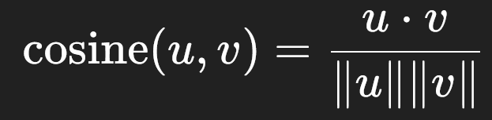

# 📘 Control Questions – Answers

### 1. What is a user–item matrix and how is it constructed?

A user–item matrix is a 2D table where rows represent users and columns represent items (e.g., courses, movies). Each cell contains the rating (or interaction) of a user with an item. It is constructed from user feedback data (ratings, clicks, purchases).

---

### 2. What is the difference between value 0 and values 1–5 in the rating matrix?

* `0` → means *missing value* (the user has not rated/taken the item).
* `1–5` → actual ratings given by the user, where higher values typically mean stronger preference.

---

### 3. How can you compute the average rating per row and per column in NumPy?

```python
row_avg = np.mean(R, axis=1)   # average per user (row)
col_avg = np.mean(R, axis=0)   # average per item (column)
```

---

### 4. What is the idea of user-based collaborative filtering (CF)?

It recommends items to a user based on preferences of *similar users*. The assumption is that “users who behaved similarly in the past will like similar items.”

---

### 5. How is cosine similarity computed between users?

For two users represented as vectors **u** and **v**:


---

### 6. What does the parameter k=5 mean in recommendations?

It means we return the **top-5 recommended items** for each user.

---

### 7. How does item-based CF differ from user-based CF?

* **User-based CF**: finds similar users and recommends what they liked.
* **Item-based CF**: finds similar items and recommends items similar to those the user already liked.

---

### 8. How do you split data into train/test for CF?

By randomly splitting observed ratings (non-zero entries) into training and test sets, e.g., 80% train and 20% test.

---

### 9. How are precision@k and recall@k metrics calculated?

* **Precision@k** = fraction of recommended items in top-k that are relevant.
* **Recall@k** = fraction of relevant items that appear in the top-k recommendations.

---

### 10. Why is visualization of recommendations (e.g., bar chart) useful?

It helps to **interpret results**, compare algorithms, and explain recommendations to users in an intuitive way.

---

### 11. What is an adjacency matrix of a graph?

A square matrix where element (A[i,j]) is `1` if there is an edge between nodes i and j, and `0` otherwise.

---

### 12. How can you make an adjacency matrix symmetric?

By ensuring (A = A^T). If edges are undirected, set both (A[i,j]) and (A[j,i]) to the same value.

---

### 13. How do you compute the degree of a vertex?

The degree of vertex (i) is the sum of its row (or column):


---

### 14. What does the element A²[i, j] represent?

It represents the number of **paths of length 2** between vertices (i) and (j).

---

### 15. How can you determine the “indirect friends” of a user?

By checking nonzero entries in (A^2) (paths of length 2) for that user.

---

### 16. What are the eigenvalues of a matrix?

Scalars (\lambda) such that (A v = \lambda v) for some nonzero vector (v).

---

### 17. What is the spectral radius?

The largest absolute value among all eigenvalues of a matrix.

---

### 18. Why is the spectral radius important for graph analysis?

It relates to connectivity, stability of processes (like spreading in networks), and convergence of iterative algorithms.

---

### 19. What is a tensor in NumPy?

A multi-dimensional array (generalization of scalars, vectors, and matrices).

---

### 20. What is the dimensionality of the temperature tensor in the task?

It is **3D**: (cities × days × hours).

---

### 21. How do you use slicing to select data for one city? For one day?

```python
temps[city_idx, :, :]     # all data for one city
temps[:, day_idx, :]      # all cities for one day
```

---

### 22. How do you compute the average temperature for a city over a week?

```python
avg_city = temps[city_idx].mean()
```

---

### 23. How do you determine the hour with the lowest average temperature?

Compute mean across cities and days per hour, then find the minimum:

```python
hour = temps.mean(axis=(0,1)).argmin()
```

---

### 24. Why is the tensor reshaped into a matrix of shape (7, 72)?

To flatten 7 days × 24 hours into a 2D representation (days × hourly readings).

---

### 25. How can you calculate correlation between cities?

By using the Pearson correlation of their average temperature time series:

```python
np.corrcoef(city1, city2)
```

---

### 26. What is the shape of a NumPy array representing an RGB image?

((height, width, 3))

---

### 27. How do you crop an image to the desired size?

Using slicing, e.g.:

```python
img_cropped = img[y1:y2, x1:x2, :]
```

---

### 28. How do you access the pixel value at position (32, 32)?

```python
pixel = img[32, 32]
```

---

### 29. How do you extract only the red channel from an image?

```python
red = img[:, :, 0]
```

---

### 30. How do you invert an image?

```python
inverted = 255 - img
```

---

### 31. How is an image converted to grayscale? (Gray formula)


---

### 32. What does it mean to normalize an image to the range [0, 1]?

It means dividing pixel values by 255 so that all values lie between 0 and 1.

---

### 33. How do you perform horizontal flipping of an image in NumPy?

```python
flipped = img[:, ::-1, :]
```

---

### 34. How do you downscale an image from (64, 64) to (32, 32)?

Using slicing or interpolation:

```python
I_small = I_crop \
            .reshape(32, 2, 32, 2, 3) \
            .mean(axis=(1,3)) # Resize (32x32x3) by averaging 2x2 blocks
```

---

### 35. What is matrix factorization?

It decomposes a user–item rating matrix (R) into two low-rank matrices: (P) (users × factors) and (Q) (items × factors).

---

### 36. Which matrices are used in factorization (P and Q)?

* (P): user latent factors.
* (Q): item latent factors.

---

### 37. How do you interpret the predicted matrix R_hat = P @ Q.T?

It represents the predicted ratings of all users for all items.

---

### 38. How do MF recommendations differ from user-based and item-based CF?

MF learns **latent factors** (hidden features), while CF relies directly on explicit similarities between users or items.

---

### 39. How is RMSE calculated and what does it indicate?


It measures prediction accuracy (lower RMSE = better).

---

### 40. What do precision@5 and recall@5 mean in the context of recommendations?

* **Precision@5**: fraction of recommended top-5 items that are relevant.
* **Recall@5**: fraction of all relevant items that appear in the top-5 list.

---

### 41. How can latent factors be interpreted?

By inspecting which items load highly on each factor, often corresponding to genres, themes, or types of courses.

---

### 42. Why is it useful to plot a heatmap of the Q matrix?

It visualizes how items relate to latent factors, making interpretation easier.

---

### 43. Which hyperparameters (k, lr, reg) affect the quality of MF, and how?

* **k**: number of latent factors (controls model complexity).
* **lr**: learning rate (controls update speed).
* **reg**: regularization (prevents overfitting).

---

### 44. Which method turned out to be better in your implementation and why?

Typically, **Matrix Factorization** performs better because it captures hidden patterns and generalizes beyond explicit similarities. However, in very sparse data, item-based CF may perform comparably.
